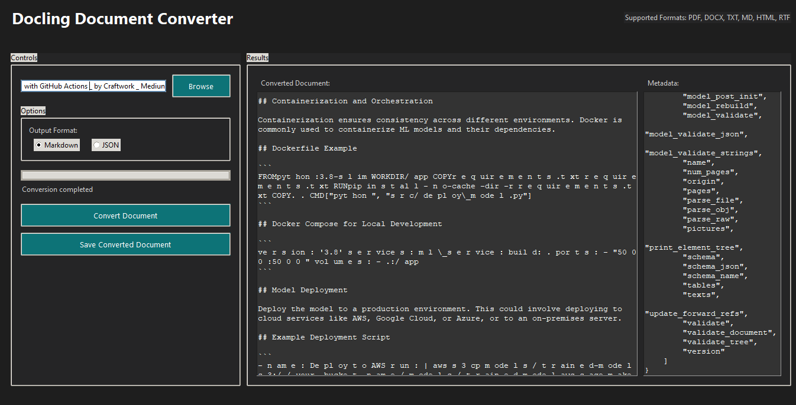

# Docling - Conversor de Documentos (Tkinter)

Esta aplicación Tkinter permite convertir documentos a formato Markdown o JSON utilizando la librería `docling`.

## Funcionalidades

- Convertir documentos PDF, DOCX, TXT, MD, HTML y RTF a Markdown o JSON.
- Mostrar la información del documento convertido en la interfaz.
- Guardar el documento convertido en un archivo.

## Cómo usar

1. Ejecuta el archivo `app_tkinter.py`.
2. Selecciona el archivo que deseas convertir utilizando el botón "Browse".
3. Selecciona el formato de salida (Markdown o JSON).
4. Haz clic en el botón "Convert Document" para iniciar la conversión.
5. Una vez completada la conversión, puedes guardar el documento convertido utilizando el botón "Save Converted Document".

## Dependencias

- tkinter
- ttk
- filedialog
- messagebox
- json
- threading
- os
- docling
